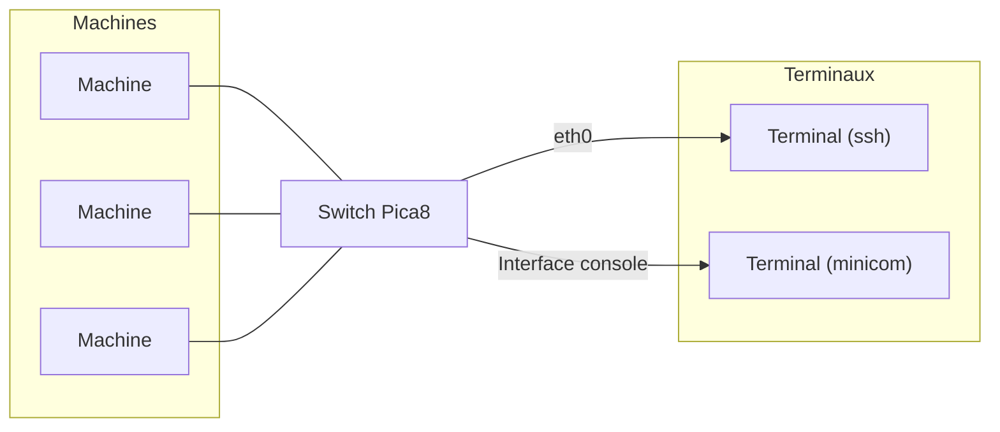

# Emerging networks

## Description

The Emerging Networks course, integrated into the Wireless Communication teaching unit, aims to present the major evolutions in network architectures and, in particular, to explain why network programmability has become a central issue. In this context, the course quickly focuses on the Software Defined Networking (SDN) paradigm, which proposes separating the control plane from the data plane in order to manage the network in a centralized manner using a controller.

The course consists of four lecture sessions and two practical lab sessions. The lectures form the theoretical core of the module and are mainly dedicated to SDN. They present the fundamental principles of the separation between the data plane and the control plane, as well as the role and operation of an SDN controller. The course also introduces OpenFlow as an interface and communication protocol that enables the controller to control network devices, and outlines its main benefits and use cases.

The teaching is complemented by two practical lab sessions, focused on the implementation and programming of SDN networks. These labs allow students to manipulate the concepts presented in the lectures, to experiment with the control of network devices, and to gain a better understanding of programmable networks.
Finally, assessment is based on a quiz as well as an analytical activity in the form of a questionnaire.

## Technical Aspects
The first lab session aimed to familiarize us with the operation of an SDN/OpenFlow network. To do so, we used Pica8 OpenFlow switches. Initially, we manually configured OpenFlow rules in order to understand how they work.

This approach also allowed us to identify the limitations of this method, as it proves to be cumbersome to implement and poorly suited to dynamic environments. We then set up an OpenFlow controller, Ryu, which makes it possible to install rules automatically.

Thus, when the switch does not know how to handle a packet, it sends an event to the controller. We were able to experiment with the simple_switch application to see how a Python script for the controller is structured.

  

  
<em>Figure 1: First tutorial setup</em>

The second lab session, meanwhile, was entirely dedicated to controller programming and aimed to illustrate the development of an SDN/OpenFlow control application. The first objective was to deploy the architecture of the scenario, identical to that of the first lab: three machines connected to an OpenFlow switch, representing two devices (D1, D2) and a gateway (GW).

  
<em>Figure 2:  Setup of the tutorial</em>

Initially, we set up the OpenFlow infrastructure by instantiating an OVS bridge acting as a switch and connecting it to the Ryu controller. We then developed a control application capable of installing initial OpenFlow rules, referred to as “static” rules.

The core of the lab consisted in implementing an equipment authentication mechanism. The gateway initiates the authentication procedure by sending an ARP request, allowing the controller to learn the device’s MAC address and its connection port. The device then transmits a specific ICMP packet whose TOS field must be equal to 0x0E. If all these parameters are consistent, the device is declared authenticated.

Once authentication is validated, the control application dynamically installs the OpenFlow rules required to authorize the device’s traffic within the network.

## Analytical

#### Learning Outcomes Assessment - Emerging network (SDN, NGN)

| **Instructor** | **Learning Outcome** | **Self‑Assessment (AE)** | **Evaluation Method** |
|---------------|----------------------|---------------------|----------------------|
| S. Abdellatif     | Understand  the fundamentals of emerging network paradigms  (Notably, Network virtualization and Software Defined Networking (SDN)) and assess their benefits for IoT | 2 / 2 | Homework assessment. |

I believe I now have understanding of the concept of SDN. Initially, I was able to observe and practically experiment with SDN logic through the implementation of flow rules, as well as the match/action mechanism specific to OpenFlow.

Furthermore, the work carried out to answer the questionnaire allowed me to step back and reflect on the concepts of SDN and NFV. This reflection helped me better understand their principles, their complementarities, and their relevance in the context of IoT, particularly in terms of flexibility, network programmability, and dynamic equipment management.

The practical lab sessions are essential in this course, as they allowed me to make concrete concepts that I initially found rather abstract. The hands-on application helped me better understand the mechanisms, see how they work in practice, and above all grasp the possibilities they offer.

| **Instructor** | **Learning Outcome** | **Self‑Assessment (AE)** | **Evaluation Method** |
|---------------|----------------------|---------------------|----------------------|
| S. Abdellatif     | Set up an SDN network and develop a basic control application | 2 / 2 | Homework assessment. |

During the lab sessions, I was able to configure an OpenFlow switch: create a bridge, add ports, verify the configuration, and manipulate a Ryu controller. I feel comfortable installing simple rules, both static and dynamic.

However, I also observe that this technology offers very extensive possibilities and great flexibility, which I am not yet able to fully exploit at this stage.

## Source

